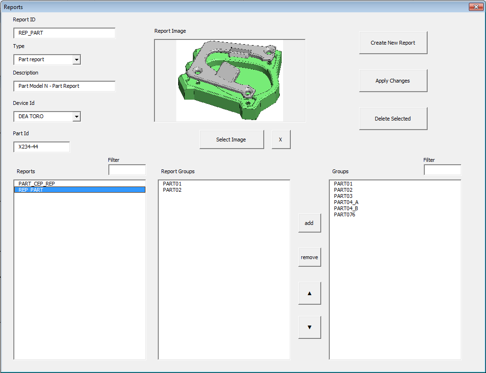

# Industrial Measurement Data Platform

An industrial software platform designed to standardize, store and analyze dimensional measurement data generated during manufacturing processes.

The system consolidates inspection data into a centralized repository and automatically generates standardized engineering reports, enabling statistical process control, production analysis and manufacturing decision support.

---

## Overview

The platform consists of two independent applications working together:

### Loader Application

Responsible for importing measurement reports generated by CMM equipment into the centralized database.

Main responsibilities:

- Import measurement reports
- Validate input files
- Standardize feature names
- Store inspection results
- Maintain historical database

---

### Reporter Application

Provides engineering reports directly from the centralized measurement database.

Available reports include:

- Part Report
- CEP Report
- Feature Reports
- Statistical summaries

Reports are generated automatically from Excel templates using VBA.

---

## Main Features

- Centralized measurement repository
- Automated report generation
- Historical inspection database
- Statistical Process Control support
- Configurable report definitions
- Feature image visualization
- Manufacturing-oriented workflow

---

## System Architecture

<picture>
    <!-- Imagen para usuarios en modo oscuro -->
    <source media="(prefers-color-scheme: dark)" srcset="docs/images/General_Architecture.png#gh-dark-mode-only">
    <!-- Imagen por defecto y para modo claro -->
    
</picture>

---

## Repository Structure

docs/
loader_app/
reporter_app/
input_files/

---

## Documentation

Complete project documentation is available in:

docs/Industrial_Measurement_Data_Platform_Case_Study.pdf

---

## Example Reports

The repository includes sample outputs:

- Part Report
- CEP Report

located under

docs/reports_examples/

---

## Technologies

- Visual Basic 6
- VBA
- Excel
- CSV
- Windows

---

## Purpose

This project was developed to demonstrate practical experience designing industrial software solutions for manufacturing environments.

Rather than focusing on programming techniques, the project emphasizes:

- Manufacturing data management
- Industrial software architecture
- Automated engineering reporting
- Production analytics
- Quality systems

---

## Author

Julian Cabrera Marceglia

Industrial Data & Quality Systems

LinkedIn

GitHub
